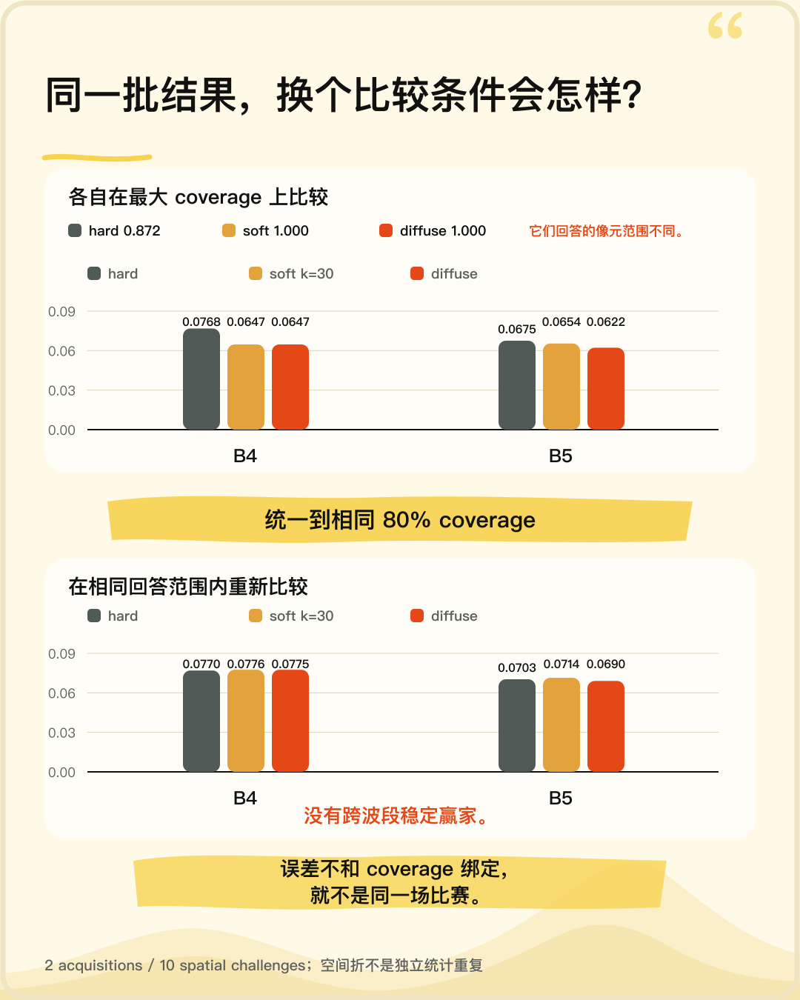

# 山地遥感物理基座

[English](README.en.md)

## 先看一个结果

三种地形辐射处理方式，各自在能回答的最大像元范围上比误差——`hard` 明显最差（0.0768）。
把它们统一到**相同的 80% 回答范围**再比，差距消失了（0.0770 / 0.0776 / 0.0775）。



原因是：一个方法可以靠**少回答**来降低误差。误差不和回答范围绑定，就不是同一场比赛。

这个仓库做的就是这类事——在山地这种标准假设失效的地方（坡面朝向决定接收多少直射光、
山峰把阴影投到几公里外、同一片地表在不同入射角下亮度差几倍），把地表状态推断的**判据先钉死，
再看结论还剩多少**。

多数结论是**否定的**。

---

## 你可以从这里带走什么

| | 在哪 |
|---|---|
| **一套可复用的负结果案例** —— 三个加性光学项如何被预注册门槛否决、一个风险排序代理如何被判定方向相反 | [Stage 7.6](stage7_real_weak_closure/stage7_6_optical_operator/) · [Stage 7.4](stage7_real_weak_closure/stage7_4_residual_reliability/) |
| **观测有效性与支持域的组织方法** —— 把「哪些像元有资格被评分」和「模型算得准不准」分成两套正交体系 | [validity-support-schema](stage7_real_weak_closure/stage7_1_observation_stack/configs/validity-support-schema-v1.json) |
| **可辨识性检查工具箱** —— 含它自己测出的原理性局限（单参数模型下 6 项检查有 3 项返回 not_applicable） | [Stage 7.5 报告](stage7_real_weak_closure/stage7_5_identity_gauge/reports/identity-gauge-report-v1.md) |
| **跨域评估的数据编排** —— 五个相对基准存在真实断裂的山区、891 个合格观测、603 对 Sentinel-2 时间匹配参考，含独立性与泄漏审计规则 | [Stage 7.8](stage7_real_weak_closure/stage7_8_multidomain_evidence/) |
| **一套结果盲工作流的实现** —— 判据冻结绑 SHA-256、协议冻结回执早于首次读结果、事后修订的暴露标记 | [Stage 7.4 evidence](stage7_real_weak_closure/stage7_4_residual_reliability/evidence/) |
| **架构文档 v3.1–v3.3**（PDF，带 SHA-256） | [docs/releases](docs/releases/) |

---

## 三个案例

### 一、我以为背阴坡缺的是天空散射光

**原先相信**：山地遥感的教科书写法——背阴坡不是全黑，因为还有天空漫射光。那就该在观测算子里
补一个加性项 `beta_v · v_sky`。

**怎么检验**：候选集、比较关系、消融顺序、指标、阈值、tie 规则全部在读任何残差之前冻结，
交叉审计通过后才跑。180 个单元 = 18 acquisition × 2 band × 5 fold。

**发现**：三个候选全部 `unsupported_by_evidence`。中位改善 **+0.06%**，冻结门槛是 5%——
差近两个数量级。而 `beta_v` 的中位绝对值达到基线 MAE 的 **0.82 倍**，主参数 alpha 被拽走 **19.9%**。

**改变了什么**：算子至今仍是最简形式 `rho_hat = alpha · mu`。这三个项从「尚未检验」变成
「已检验且未获支持」。

→ [报告](stage7_real_weak_closure/stage7_6_optical_operator/reports/optical-operator-report-v1.md) ·
[逐单元结果表](stage7_real_weak_closure/stage7_6_optical_operator/outputs/ablation-unit-table-v1.json) ·
[终态表](stage7_real_weak_closure/stage7_6_optical_operator/outputs/verdict-table-v1.json)

### 二、我以为可以用 MODIS 地类判断候选区

**原先相信**：用 `ee.Reducer.mode()` 求每个候选区的 IGBP 主导地类，据此筛选。基准区返回
「稀树草原」，看着不像高山区——于是写下两条 finding：MODIS 在高山区不可靠、某候选区主导湿地。

**怎么检验**：为给第二条补事实依据，单独查了一次频率直方图。

**发现**：直方图和 mode 完全对不上。该 reducer 在重采样之后对离散类别值失效。基准区的
「稀树草原」实际只占 **1.1%**，真实主导是占 **46.1%** 的草地。两条 finding 都建立在这个错误上。

**改变了什么**：两条全部撤回，`v1` 字节保留、另立 `v2` 记录撤回原因。若没发现，所有者会基于
两项虚假事实作出裁决，而两项都指向「判据不可靠、需要修改冻结件」。

→ [v1（错的，保留）](stage7_real_weak_closure/stage7_8_multidomain_evidence/evidence/screening-findings-v1.json) ·
[v2（撤回）](stage7_real_weak_closure/stage7_8_multidomain_evidence/evidence/screening-findings-v2.json)

### 三、我以为「子集不会比全集更分散」

**原先相信**：一条准入判据要求逐 fold 测天空可视因子的四分位距，但本节点不产出 fold 结构。
于是改测区域级，并论证：fold 训练区是区域支持区的子集，**子集的 IQR 不大于全集**，所以区域级
测得 0.0655 < 0.10 就能确定 fold 级也不满足。

**怎么检验**：仓库准备公开前的一次外部逐行复核。

**发现**：**这条性质不成立。** 反例：全集 8 个 0 加 2 个 1，IQR = 0；从中取 2 个 0 加 2 个 1，
IQR = 1。IQR 对取子集不单调。

**改变了什么**：该项判据的结论由「不满足」降为**「未确定」**，Gate 的整体结论由
`not_warranted` 减弱为 `not_established`。测量值本身没错，错的是从它推出结论的那一步。

→ [缺陷记录](stage7_real_weak_closure/stage7_8_multidomain_evidence/evidence/requalification-gate-g1-defect-v1.json)
（原报告与脚本字节不改，按 append-only 另立文件撤回该推理）

---

## 自己核一遍

案例一的判定可以直接复核，不需要跑 Earth Engine：

```
stage7_6_optical_operator/outputs/verdict-table-v1.json      四个候选的终态与判定依据
stage7_6_optical_operator/outputs/ablation-unit-table-v1.json 180 个单元的逐项拟合结果
stage7_6_optical_operator/configs/optical-operator-config-v1.json  冻结的门槛与 verdict 规则
stage7_6_optical_operator/outputs/result-audit-v1.json        Y1–Y11 审计与负例自检
```

判定是机械执行 config 里的 `verdict_rules` 得到的。报告单位是 `acquisition × band × fold`，
按 `equal_per_acquisition_band` 等权——**不按像元数加权**，防止大 support 的景主导结论。
一个候选要判 qualified，五条须同时成立：

1. 相对基线的 MAE 中位相对改善 ≥ **0.05**
2. 5 个 fold 中至少 **4 个**方向一致
3. 参数边界命中单元占比 ≤ **0.10**
4. 梯度与数值稳定性检查通过
5. 该候选的支持域通过 `support_gate`（两参数模型另要求 fold 训练支持区内 v_sky 的 IQR ≥ 0.05，
   否则两列共线、属实际不可辨识，判 `unsupported` 而非硬解）

比较还须满足 coverage 可比性（容差 0.001，超出则该单元不进入比较集并登记
`coverage_mismatch`）。以 config 为准，上面是摘要不是替代。

**其余多数 stage 的 `outputs/` 与 `obsidian_drafts/` 不入 git**（前者体量原因、主要是 GeoTIFF，
后者是早期脚本生成的笔记草稿），字节身份由 `evidence/` 里的 manifest 与 SHA-256 承担。
早期报告中出现的 `obsidian_drafts/...` 引用是当年产出的真实记录，路径本身不随仓库分发。这意味着：**结论可追溯，但外部读者尚不能端到端重跑全部环节。**
这是当前仓库的已知限制，不掩饰。

---

## 主线走到哪了

物理链路自下而上：地形几何 → 光照与可见性 → 观测算子 → 状态反演。目前止步于**第三层**。

**当前状态：暂停。** 下一关需要的两样东西——已资格化的观测算子、已激活的状态——上游各交出了
一个空集，且都是正常执行、通过各自 fail-closed 审计后的**有效负结果**，不是流程故障。

一个节点因此判定**自己无法开工**，并拒绝把责任推给上游：「上游没有失效，它准确地完成了工作。」
→ [预检裁决](stage7_real_weak_closure/stage7_9_l3_closed_loop/evidence/activation-preflight-manifest-v1.json)

---

## 这个项目是怎么被管起来的

这个仓库里没有一个 issue、没有一块看板、没有一份进度表。项目状态、路线、节点、
规则、判据，全在**另一处**：一棵树。

那棵树跑在 **PF3** 上——我自己写的一台 MCP 服务器，
专门用来让多个 AI 窗口围绕同一份项目状态工作。[公开展示与设计说明](https://github.com/zhaoxiuyue/pf3-showcase)介绍这套做法；完整实现目前保留私有。这个项目是它管出来的第一个案例：

- **三个客户端写同一棵树。** `claude-code`、`oauth:chatgpt`、`codex` —— 分属两家模型厂商的
  工具，写的是同一份状态，不是各存各的。每次写入要带上你读到的那个版本号，对不上就拒绝；
  路线 `rt_f634f0ab72fb` 的版本号单调涨到 100，没出现过一次并发覆盖。
- **截至 2026-09-10 停靠日：80 天，93 个提交。** 每一次推进、每一条约束、每一次撤回，在树上都有一张回执，
  记着谁写的、从哪版到哪版、能不能撤。撤销不是把痕迹抹掉，是再加一条记录。
- **最后是主动停靠，不是断掉。** 2026-09-10 停在全线零 active 节点、零冻结时序在跑、
  零半成品的状态上，停的理由和复垦条件写在项目的 statusReason 里，不在谁的记忆里。

上面第三个案例（那条被外部复核查出来的推理错误）也是同一套东西记下来的：原报告字节不改，
另立缺陷记录，结论从「不满足」降为「未确定」，并同时写明它**不**解除下游阻断——
更正不能顺手扩大自己的战果。

→ **[一棵树，三个客户端，一个停靠日](docs/one-tree-three-clients.md)** ——
带节点 id 和回执 id 的完整复盘：乱是怎么被治住的、三个角色各裁什么、
以及最诚实的那一段。

一套协作系统值不值得信，看的不是它出不出错，是出错之后还查不查得到、记不记得住、
改动够不够显眼。

---

## 目录怎么读

```
stages/                      科研工作包区。每个 stage 是自足容器，各自带 README
stage7_real_weak_closure/    历史证据区。冻结不迁，字节不改，更正一律 append-only
docs/                        架构文档（四版 PDF 与 SHA-256）＋ 项目管理复盘
_ops/                        一次性整理的操作记录，搬前搬后全量哈希清单
```

`stage7_real_weak_closure` 这个名字看着像「没做完」，其实是字面意思：这一段做的就是
*weak closure*（弱闭环）——在真实数据上把链路走通，但不声称跨域泛化。不改名是因为区内的
冻结合同与审计器**按路径**引用它。

进任何 stage 容器，先读它的 `README.md`。

---

## 需要知道的边界

- **Stage 1–6 是 toy model**，用真实地形但观测是合成的，结论不可外推到真实数据。真实观测从
  Stage 6.5 开始，那一关终态是 `BLOCKED`——单景切不出空间独立的 holdout。
- **所有结论限于单 ROI**（岷山）除非另有说明。空间折不是独立样本。
- 文档中的「所有者」与「执行手」是项目内部的角色分工记号，不是多人团队。
- 数据来自 Landsat 8/9 C2 L2SR、Sentinel-1 GRD、Sentinel-2 SR、SRTM，均经 Google Earth Engine 获取。

---

## 关于作者

这个项目由我一个人提出、设计并推进。我承担的是：**提出问题、定义什么算证据、设计判据与停止
条件、以及在证据不足时决定停下而不是继续。**

仓库里的冻结规则、暴露标记与 fail-closed 门禁都为此服务——包括那条把我自己的一次裁决标记为
「事后修订」的规则。规则约束的第一个人是我。

文档中的「所有者」「执行手」「审计」是项目内部的角色分工记号，不是多人团队。

**我在找什么**：合作或委托。最合适的情形是——你手上有件事做出来了，但你不确定能不能信；
或者你要把一件事交给别人（或 AI）去做，担心拿回来的是**看起来很好**的东西。

领域不限。**域知识可以现学，标准怎么定不行。** 也欢迎直接质疑上面任何一个结论。

**我不做什么**：这里展示的是我工作的方式本身，不是一套能打包传授的方法论。想要流程培训或
工具教学的话，我帮不上。

—— Elara

联系：XiuyueZhao@outlook.com

---

## 许可

[CC BY 4.0](LICENSE)——署名即可自由使用，包括商用。用到这里的方法、判据、数据编排或结论时，
请注明来源。
